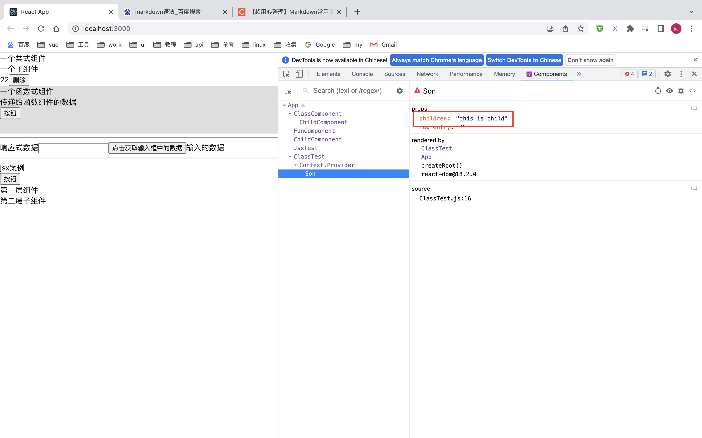

## 组件进阶

### 1. children 属性

* children属性是什么

  表示该组件的子节点，只要组件内部有子节点，props就有该属性

* children可以是什么

  1. 普通文本
  2. 普通标签元素
  3. 函数
  4. Jsx

  案例:

```js
import React, {Component, createContext} from "react";

const {Provider, Consumer} = createContext()
// 第一层组件
class ClassTest extends Component {
    state = {
        content: '共享数据'
    }
    render() {
        return (
            <Provider value={this.state.content}>
                <div>第一层组件</div>
                {
                    // 在组件中间添加元素，就存在children
                  // 可以是字符串，函数，jsx（并列传递是一个数组）
                }
                <Son>
                    this is child
                    {()=>console.log(123)}
										{<div>jsx</div>}
                </Son>
            </Provider>

        )
    }
}
// 第二层组件
function Son(props) {
    console.log('----')
    console.log(props.children)
    return (
        <>
            <div>第二层子组件</div>
            {
                //使用children
            }
            {props.children}
        </>
    )
}
```

就会有下图元素




### 2. props校验-场景和使用

##### 实现步骤

1. 安装校验包 ： ` npm install prop-types`
2. 导入prop- type
3. 使用`组件名.propTypes = {}` 给组件添加校验

案例：

```js
import React, {Component} from "react";
import PropTypes from "prop-types";

// 第一层组件
class ClassTest extends Component {
    state = {
        content: '1'
    }
    render() {
        return (
            <div>
                <Son content={this.state.content}/>
            </div>
        )
    }
}
// 第二层组件
function Son(props) {
    return (
        <>
            <div>第二层子组件</div>
            <div>{props.content}</div>
        </>
    )
}

// 校验组件属性
Son.propTypes = {
    // 表示类型为string并且不为空
    content: PropTypes.string.isRequired
}
```

### 3. prop校验-规则说明

##### 四种常见结构

1. 常见类型：array，bool,func,number,object,string
2. react元素类型： element
3. 必填项： isRequired
4. 特定的结构对象： shape({})


### 4. prop校验-默认值

##### 函数组件写法

写法1

```js
function Son(props) {
    return (
        <>
            <div>第二层子组件</div>
            <div>{props.content}</div>
        </>
    )
}

// 校验组件属性
Son.defaultProps = {
    // 表示类型为string并且不为空
    content: 100
}
```

写法2（推荐）

```js
function Son({content=10}) {
    return (
        <>
            <div>第二层子组件</div>
            <div>{content}</div>
        </>
    )
}
```


##### 类组件

写法1

与函数式写法1一致

写法2

类的静态值(推荐)

```js
class ClassTest extends Component {
    // 默认传值
    static defaultProps = {
        content: 10
    }
    render() {
        return (
            <div>
                <Son content={100}/>
            </div>
        )
    }
}
```


