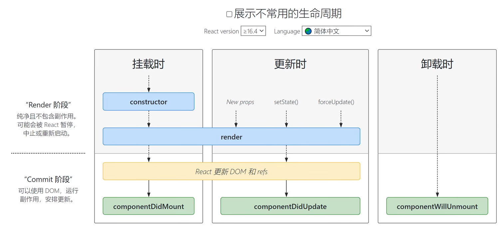

## 生命周期

- 组件生命周期是指组件从被创建到挂载到页面运行起来，再到组件不用时卸载掉过程，注意：只有类组件才有生命周期

### 1. 挂载阶段

constructor ---> render ---> componentDiMount

| 钩子函数          | 触发时机                                            | 作用                                           |
| :---------------- | --------------------------------------------------- | ---------------------------------------------- |
| constructor       | 创建组件时，最先执行，初始化的时候只执行一次        | 1.初始化state 2.创建ref 3.使用bind解决this问题 |
| render            | 每次组件渲染都会触发（数据更新也会触发）            | 渲染UI（注意：不能在里面调用setState()）       |
| componentDidMount | 组件挂载（完成DOM渲染）后执行，初始化的时候执行一次 | 发送网络请求，执行DOM                          |

### 2. 更新阶段

| 钩子函数           | 触发时机                  | 作用                                                     |
| ------------------ | ------------------------- | -------------------------------------------------------- |
| Render             | 每次组件渲染都会触发      | 渲染UI（与挂载阶段是同一个）                             |
| componentDidUpdate | 组件更新后（dom渲染完毕） | dom操作，可以获取更新后的dom内容，不要直接调用setState() |

### 3. 卸载阶段

| 钩子函数             | 触发时机                 | 作用                         |
| -------------------- | ------------------------ | ---------------------------- |
| componentWillUnmount | 组件卸载（从页面中消失） | 执行清理工作（清理定时器等） |

